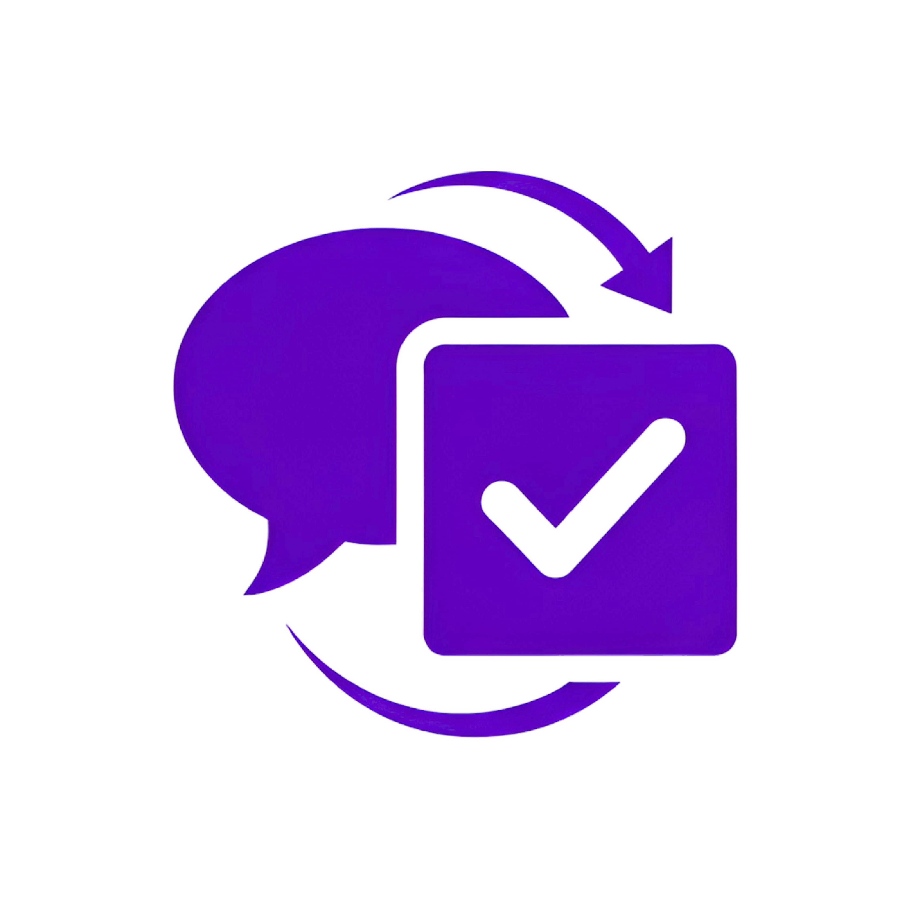

<div align="center">
  
  
  # Talk2Task AI
  
  **Turning Conversations into 
Coordinated Actions**
  
  [](https://reactjs.org/)
  [](https://www.typescriptlang.org/)
  [](https://vitejs.dev/)
  [](https://tailwindcss.com/)

  <br />
  
  <a href="https://talk2task-ai.netlify.app">
    
  </a>
  
  <br />
</div>

---

## 📋 Table of Contents
- [Overview](#overview)
- [Key Features](#key-features)
- [Tech Stack](#tech-stack)
- [Project Structure](#project-structure)
- [Getting Started](#getting-started)
  - [Prerequisites](#prerequisites)
  - [Installation](#installation)
  - [Running Locally](#running-locally)

---

## Overview

**Talk2Task AI** is a cutting-edge meeting intelligence platform designed to bridge the gap between conversation and execution. It leverages advanced AI to analyze meeting recordings, transcripts, and notes, automatically extracting:

- **Actionable Tasks**: Assigned with priorities and due dates.
- **Critical Risks**: Identified with severity levels and mitigation strategies.
- **Key Decisions**: Logged for future reference and accountability.

Whether you're a project manager, developer, or executive, Talk2Task AI ensures that no critical detail is lost in the noise of daily meetings.

---

## Key Features

- **🎙️ Multi-Source Ingestion**: Upload audio/video files, paste transcripts, or record live meetings directly in the browser.
- **🧠 AI-Powered Analysis**: Automatically generates Minutes of Meeting (MoM), extracts tasks, and identifies risks.
- **⚡ Automation Studio**: Build visual workflows to automate post-meeting actions (e.g., "If High Risk -> Email Manager").
- **🔔 Smart Integrations**: Seamlessly push tasks and reminders to Slack, Jira, and other tools.
- **📊 Interactive Dashboard**: Visualize meeting activity, task completion rates, and risk trends.
- **📝 Follow-Up Assistant**: AI-suggested follow-up emails and calendar invites based on meeting context.

---

## Tech Stack

Built with a modern, performance-focused stack:

| Category | Technology | Description |
|----------|------------|-------------|
| **Frontend** | React 19 | Latest features for a responsive, dynamic UI |
| **Language** | TypeScript | Type-safe code for reliability and maintainability |
| **Build Tool** | Vite | Blazing fast build times and hot module replacement |
| **Styling** | Tailwind CSS | Utility-first CSS for rapid, custom design |
| **Icons** | Lucide React | Clean, consistent, and lightweight icons |
| **Charts** | Recharts | Interactive and responsive data visualization |
| **DnD** | @dnd-kit | Smooth drag-and-drop for the Workflow Builder |

---

## Project Structure

A clean, modular architecture designed for scalability:

```
src/
├── components/        # Reusable UI building blocks
│   ├── atoms/         # Basic elements (Buttons, Inputs, Badges)
│   ├── molecules/     # Complex components (Cards, NavItems)
│   └── organisms/     # Major UI sections (WorkflowList, NodeConfig)
├── layouts/           # Page layouts (MainLayout, Sidebar)
├── pages/             # Application route views (Dashboard, Meetings)
├── services/          # Business logic and API handling
├── types/             # TypeScript definitions and interfaces
├── utils/             # Helper functions and formatters
└── mocks/             # Sample data for demo purposes
```

---

## Getting Started

Follow these steps to set up the project locally on your machine.

### Prerequisites

- **Node.js** (v18 or higher)
- **npm** or **yarn** package manager

### Installation

1.  **Clone the repository:**
    ```bash
    git clone https://github.com/tirth-2001/talk2task_ai_code.git
    cd talk2task_ai_code
    ```

2.  **Install dependencies:**
    ```bash
    yarn install
    # or
    npm install
    ```

### Running Locally

1.  **Start the development server:**
    ```bash
    yarn dev
    # or
    npm run dev
    ```

2.  **Open your browser:**
    Navigate to `http://localhost:5173` to view the application.

---

<div align="center">
  <sub>Built with ❤️ by the <i>Talk2Task AI Team</i> from India</sub>
</div>
